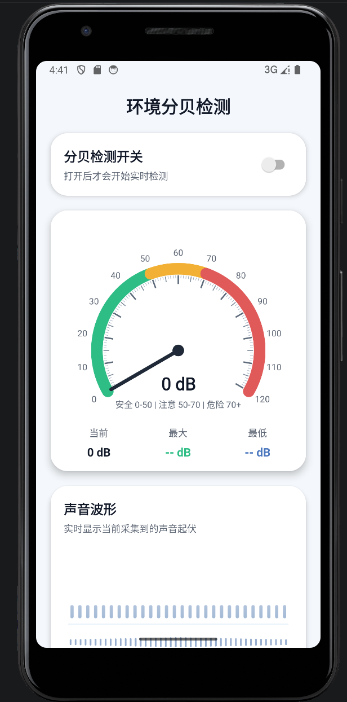

# DecibelDetection

一个基于 Android 原生 View 的环境分贝检测示例应用。  
应用通过麦克风实时采集音频数据，计算当前分贝值，并用仪表盘和波形图展示声音变化。

## 应用截图




## 功能特性

- 实时采集麦克风音频
- 根据音频 RMS 估算当前分贝值
- 显示当前、最大、最小分贝
- 使用自定义仪表盘展示分贝区间
- 使用自定义波形图展示实时声音波动
- 支持开关控制检测开始与停止

## 技术栈

- Java
- Android SDK
- AppCompat
- Material Components
- ConstraintLayout
- `AudioRecord` 实时录音采样

## 环境要求

- Android Studio 较新版本
- JDK 21
- Android SDK 36
- 最低支持 Android 14 (`minSdk 34`)

说明：
当前项目使用 `AGP 9.1.0`，构建时需要 JDK 21。若本机仍是 JDK 8 或更低版本，Gradle 会无法正常构建。

## 运行方式

1. 使用 Android Studio 打开项目目录 `DecibelDetection`
2. 确认 Gradle JDK 已设置为 JDK 21
3. 等待 Gradle 同步完成
4. 连接真机或启动模拟器
5. 运行 `app` 模块
6. 首次进入应用后授予麦克风权限
7. 打开页面中的检测开关，开始实时分贝检测

## 构建命令

调试包：

```bash
./gradlew assembleDebug
```

发布包：

```bash
./gradlew assembleRelease
```

## 项目结构

```text
app/
├─ src/main/java/com/example/decibeldetection/
│  ├─ MainActivity.java         // 主页面，处理权限、录音、UI 更新
│  ├─ DecibelGaugeView.java     // 分贝仪表盘自定义 View
│  └─ WaveformView.java         // 声音波形自定义 View
├─ src/main/res/layout/
│  └─ activity_main.xml         // 主界面布局
└─ proguard-rules.pro           // Release 混淆规则

